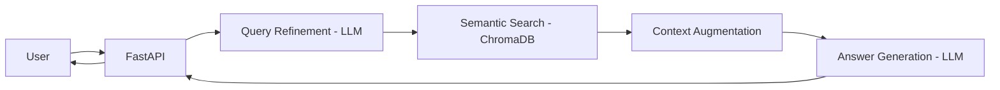

# 🇵🇱 PLConstitutionAI: Advanced Legal Query System

[](https://www.python.org/)
[](https://fastapi.tiangolo.com/)
[](https://ai.google.dev/)
[](https://www.trychroma.com/)
[](https://opensource.org/licenses/MIT)

An advanced **Retrieval-Augmented Generation (RAG)** system designed for natural language interaction with the Constitution of the Republic of Poland. This project focuses on high factual precision, hallucination mitigation, and clean architectural principles.

---

## Engineering Highlights

This project goes beyond a simple LLM wrapper by implementing industry-standard RAG optimization techniques:

* **Clean Architecture (Domain-Driven Design Lite):** Full separation of concerns. Domain logic is decoupled from infrastructure (LLMs, Vector Stores) using Abstract Base Classes (Interfaces), ensuring the system is highly testable and vendor-agnostic.
* **AI-Driven Metadata Enrichment:** During the indexing phase, every constitutional article is analyzed by an LLM to generate semantic tags. these tags are stored as metadata, significantly enhancing the precision of the semantic search.
* **Two-Step Query Refinement:** To bridge the gap between user vernacular and formal legal terminology, the system utilizes a "Query Refinement" step. User questions are transformed into optimized legal keywords before searching the vector database.
* **Strict Fact-Checking:** A constrained System Prompt ensures that the assistant answers *only* based on the retrieved context, citing specific Article numbers to maintain legal integrity.

---

## System Architecture

The project is structured into three distinct layers to ensure scalability and maintainability:

1. **Domain:** Core interfaces and Pydantic data models.
2. **Application:** Orchestration logic (Query Engine, Indexer Service).
3. **Infrastructure:** Implementation details (Gemini API, ChromaDB, Web Scraper).

### Information Flow


---

## Tech Stack

* **Language:** Python 3.13+
* **LLM & Embeddings:** Google Gemini Suite (`gemini-3.1-flash-lite` for inference efficiency, `gemini-embedding-2` for high-dimensional vector representations).
* **Vector Database:** ChromaDB (Persistent storage with Cosine Similarity).
* **Web Framework:** FastAPI (Asynchronous endpoints with background task support).
* **Package Management:** `uv` (Next-generation Python package manager).

---

## Project Origin

This project was developed as a final assignment for the **Deep Learning and Computer Vision** course, part of the **Machine Learning and AI Engineering** postgraduate program at **Warsaw University of Life Sciences**.

---

## Getting Started

### Prerequisites
*   Google Gemini API Key ([Obtain here](https://aistudio.google.com/))

### Installation (via `uv`)
```bash
# Clone the repository
git clone https://github.com/21010/pl-constitution-ai.git
cd pl-constitution-ai

# Install dependencies and create environment
uv sync

# Configure environment variables
echo "GEMINI_API_KEY=your_api_key_here" > .env
```

### Running the Application
```bash
# Start the FastAPI server
uv run main.py
```
The application will be available at `http://localhost:8000`.

---

## Example Queries

| User Question | System Response (Sample) | Source |
| :--- | :--- | :--- |
| "Who can become President?" | "A Polish citizen, at least 35 years old..." | Art. 127 |
| "How long is the Sejm's term?" | "The term of the Sejm is 4 years..." | Art. 98 |
| "Is private property protected?" | "The Republic of Poland shall protect ownership..." | Art. 21 |

---

## Roadmap
- [ ] Implement Hybrid Search (BM25 + Dense Vector Re-ranking).
- [ ] Add conversation memory (Multi-turn chat).
- [ ] Export legal analysis to PDF/Markdown.
